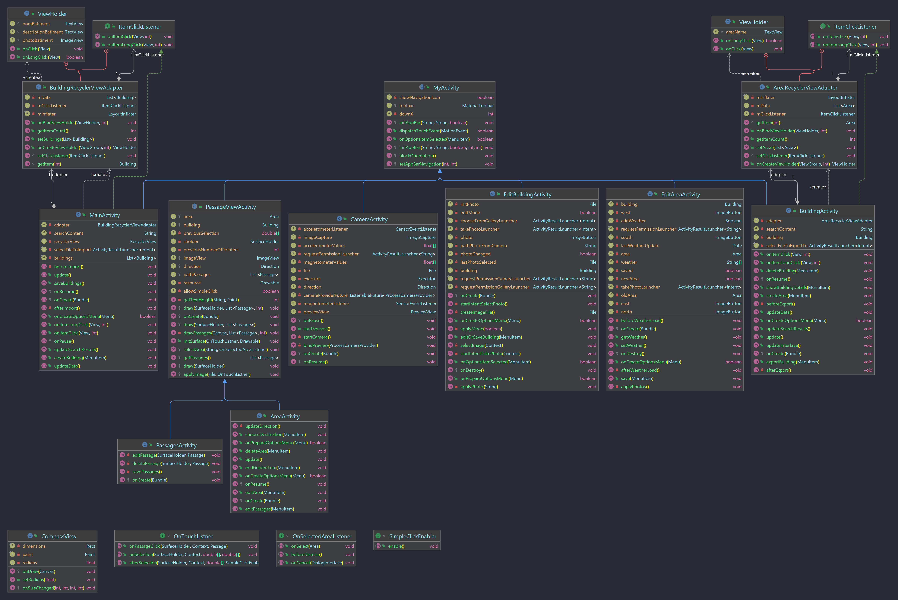

# RoomView
RoomView est une application Android permettant d'explorer des bâtiments.
Elle est disponible en Français et en Anglais, et en thème sombre et clair.


# Au niveau du code
## Architecture
### Modèles

Au niveau des modèles utilisés, rien de bien extraordinaire.

On a cependant, une classe abstraite [`ManipulateFiles`](./src/app/src/main/java/fr/antoinectx/roomview/models/ManipulateFiles.java) qui permet de manipuler des fichiers, et qui est étendue par les classes [`Area`](./src/app/src/main/java/fr/antoinectx/roomview/models/Area.java) et [`Building`](./src/app/src/main/java/fr/antoinectx/roomview/models/Building.java).
Cette classe permet de réaliser les opérations sur les fichiers que les classes [`Area`](./src/app/src/main/java/fr/antoinectx/roomview/models/Area.java) et [`Building`](./src/app/src/main/java/fr/antoinectx/roomview/models/Building.java) doivent réaliser.

Pour gérer la direction (Nord, Sud, Est, Ouest), on utilise une énumération [`Direction`](./src/app/src/main/java/fr/antoinectx/roomview/models/Direction.java).
Cette énumération permet de gérer les directions, et de les convertir en chaîne de caractères (dans la langue de l'utilisateur), et de donner la direction suivante si on tourne à droite ou à gauche.

### Activités

#### [`MyActivity`](./src/app/src/main/java/fr/antoinectx/roomview/MyActivity.java)
Toutes les activités héritent de la classe [`MyActivity`](./src/app/src/main/java/fr/antoinectx/roomview/MyActivity.java), qui permet notamment de simplifier l'initialisation et la modification de la `MaterialToolbar` ([`initAppBar`](./src/app/src/main/java/fr/antoinectx/roomview/MyActivity.java#L32) et [`setAppBarNavigation`](./src/app/src/main/java/fr/antoinectx/roomview/MyActivity.java#L63)).
Elle permet également de verrouiller l'orientation de l'écran ([`blockOrientation`](./src/app/src/main/java/fr/antoinectx/roomview/MyActivity.java#L137)), et de faire disparaître le clavier quand on clique en dehors d'un champ de texte ([`dispatchTouchEvent`](./src/app/src/main/java/fr/antoinectx/roomview/MyActivity.java#L85)).

#### [`PassageViewActivity`](./src/app/src/main/java/fr/antoinectx/roomview/PassageViewActivity.java)
Les activités permettant de consulter une zone ([`AreaActivity`](./src/app/src/main/java/fr/antoinectx/roomview/AreaActivity.java)) et de modifier les passages ([`PassagesActivity`](./src/app/src/main/java/fr/antoinectx/roomview/PassagesActivity.java)) sont très proches, elles héritent donc de la classe abstraite [`PassageViewActivity`](./src/app/src/main/java/fr/antoinectx/roomview/PassageViewActivity.java).
Ces activités ont notamment en commun :
- données reçues en extra de l'intent ([`onCreate`](./src/app/src/main/java/fr/antoinectx/roomview/PassageViewActivity.java#L129))
- une `ImageView` pour afficher la photo et une `SurfaceView` pour dessiner les passages (rassemblées dans un même layout [`passages_view.xml`](./src/app/src/main/res/layout/passages_view.xml))
- doivent dessiner les passages ([`draw`](./src/app/src/main/java/fr/antoinectx/roomview/PassageViewActivity.java#L158))
- gérer les clics sur les passages (avec les mêmes cas d'erreurs) ([`initSurface`](./src/app/src/main/java/fr/antoinectx/roomview/PassageViewActivity.java#L302))
- demander de choisir une zone ([`selectArea`](./src/app/src/main/java/fr/antoinectx/roomview/PassageViewActivity.java#L444))

Cependant, elles ne font pas les mêmes actions lorsque l'on touche la `SurfaceView`, ou après avoir choisit une zone.
Les interfaces [`OnTouchListner`](./src/app/src/main/java/fr/antoinectx/roomview/PassageViewActivity.java#L50) et [`OnSelectAreaListener`](./src/app/src/main/java/fr/antoinectx/roomview/PassageViewActivity.java#L94) permettent de gérer ces différences.
Chaque activité définit donc ses propres actions.


## Fichiers
Les bâtiments de l'application sont stockés dans le répertoire de l'application de la manière suivante :
```
.
├── <id du bâtiment 1>
│   ├── <id de la zone 1>
│   │   ├── Est_<timestamp>.jpg
│   │   ├── Nord_<timestamp>.jpg
│   │   ├── Ouest_<timestamp>.jpg
│   │   └── Sud_<timestamp>.jpg
│   ├── <id de la zone 2>
│   │   ├── Est_<timestamp>.jpg
│   │   ├── Nord_<timestamp>.jpg
│   │   ├── Ouest_<timestamp>.jpg
│   │   └── Sud_<timestamp>.jpg
│   ├── <id du bâtiment 1>.jpg
│   └── data.json
└── <id du bâtiment 2>
    ├── ...
    └── data.json
```
Les instances de `Building` peuvent se sauvegarder dans un dossier qui leur est propre.
`Building` est aussi capable de restaurer les bâtiments à partir de ces dossiers.

Le fichier `data.json` contient toutes les informations sur le bâtiment, et sur les zones qui le composent.

### Importation / Exportation
L'application permet de partager des bâtiments.
Pour cela, on peut exporter le dossier du bâtiment dans un fichier zip.

Lorsque l'on importe un bâtiment, son id est changé pour éviter les conflits.

## Images
Les images chargent rapidement, et sont stockées en cache pour éviter de les recharger à chaque fois,
grâce à la librairie **Glide** (voir [Dépendances](#dépendances)).
**Glide** gère toutes les images de l'application, y compris l'icône de la météo, qu'il se charge de télécharger.

Si une image n'est pas disponible, on affiche une image par défaut.

Lorsqu'on se trouve dans une zone, les images suivantes (gauche et droite) sont préchargées pour améliorer l'expérience utilisateur.

L'utilisation d'un système de cache s'est avéré nécessaire rapidement dans le développement de l'application.
En effet, les images dans la liste des bâtiments étaient très lentes à charger, et le système de cache a permis de résoudre ce problème.
C'est à ce moment que j'ai décidé d'utiliser **Glide** pour la gestion des images.

## API OpenWeatherMap
Pour obtenir la météo, l'application utilise l'API OpenWeatherMap.
La clef d'API est stockée dans le fichier `./src/local.properties` sous la forme `WEATHER_API_KEY=<clef d'API>`.

On peut accéder à cette clef dans le code, grâce à `secrets-gradle-plugin` (voir [Dépendances](#dépendances)), de la manière suivante :
```java
String apiKey = BuildConfig.WEATHER_API_KEY;
```

## Apparence
Les thèmes sombre et clair sont disponibles.
Les couleurs utlisées sont les suivantes :


Pour la toolbar, j'ai utilisé une [`MaterialToolbar`](https://m2.material.io/components/app-bars-top) avec le texte centré.
Les champs de texte suivent le [Material Design 3](https://material.io/components/text-fields).

## Dépendances
- [CameraX](https://developer.android.com/training/camerax) : pour la prise de photos depuis l'application
- [Glide](https://bumptech.github.io/glide/) : pour la gestion des images
- [JGraphT](https://jgrapht.org/) : pour déterminer les chemins les plus courts
- [Material](https://material.io/develop/android/docs/getting-started/) : pour certains composants graphiques
- [Secrets Gradle Plugin for Android](https://github.com/google/secrets-gradle-plugin) : pour accéder à la clef d'API OpenWeatherMap dans le code sans que celle-ci soit visible dans le git

Voir [build.gradle](./src/app/build.gradle) pour la liste exhaustive des dépendances utilisées et leur version.

# Manuel d'utilisation
- [Ajouter un bâtiment](#ajouter-un-bâtiment)
  - [Créer un bâtiment](#créer-un-bâtiment)
  - [Importer un bâtiment](#importer-un-bâtiment)
- [Consulter les informations du bâtiment](#consulter-les-informations-du-bâtiment)
- [Modifier un bâtiment](#modifier-un-bâtiment)
- [Exporter un bâtiment](#exporter-un-bâtiment)
- [Supprimer un bâtiment](#supprimer-un-bâtiment)
- [Ajouter une zone](#ajouter-une-zone)
- [Modifier une zone](#modifier-une-zone)
- [Supprimer une zone](#supprimer-une-zone)
- [Ajouter un passage](#ajouter-un-passage)
- [Modifier un passage](#modifier-un-passage)
- [Se déplacer](#se-déplacer)
- [Visite guidée](#visite-guidée)
  - [Trouver son chemin](#trouver-son-chemin)
  - [Se laisser guider](#se-laisser-guider)

## Ajouter un bâtiment
Pour ajouter un bâtiment, cliquez sur l'icône en haut à droite (en forme de plus).
Une boîte de dialogue s'ouvre. Deux choix s'offrent à vous :
- [Créer un bâtiment](#créer-un-bâtiment)
- [Importer un bâtiment](#importer-un-bâtiment)

### Créer un bâtiment
Pour créer un bâtiment, remplissez les champs de la boîte de dialogue.
Ces champs sont optionnels, vous pouuvez ne rien remplir et valider directement.

Et voilà, votre bâtiment est créé ! Vous pouvez maintenant le [modifier](#modifier-un-bâtiment) et [ajouter des zones](#ajouter-une-zone).

### Importer un bâtiment
Pour importer un bâtiment, cliquez sur le bouton "Importer un bâtiment" en bas de la boîte de dialogue.
Vous pouvez ensuite sélectionner le fichier .zip qui a été [exporté](#exporter-un-bâtiment).

## Consulter les informations du bâtiment
Pour consulter les informations d'un bâtiment, cliquez sur "Détails" dans le menu du bâtiment, ou appuyez longuement sur le bâtiment depuis la liste des bâtiments.

Sur cette page, vous pouvez lire la description du bâtiment et voir la photo associée.

En cliquant sur l'icône en haut à droite (en forme de crayon), vous pouvez [modifier le bâtiment](#modifier-un-bâtiment).

## Modifier un bâtiment
Pour modifier un bâtiment, cliquez sur l'icône en haut à droite (en forme de crayon) dans la page des détails du bâtiment.

Vous pouvez alors modifier les champs et modifier la photo du bâtiment.

Pour modifier la photo, cliquez sur la photo actuelle. Une boîte de dialogue vous permet de choisir entre :
- Prendre une photo
- Choisir une photo dans la galerie

Pensez à valider vos modifications en cliquant sur le bouton en haut à droite (en forme de disquette).
Vous pouvez également annuler vos modifications en cliquant sur le bouton en haut à gauche (en forme de croix).

*Remarque :
Pour éviter de perdre vos modifications, l'orientation de l'écran se bloque dans le sens où vous avez ouvert la page.*

## Exporter un bâtiment
Pour exporter un bâtiment, cliquez sur "Exporter" dans le menu du bâtiment et choisissez le dossier où vous souhaitez exporter le fichier .zip.
Après quelques secondes, l'application vous indique que l'exportation est terminée.

Vous pouvez ensuite [importer ce bâtiment](#importer-un-bâtiment) sur un autre appareil.

## Supprimer un bâtiment
Pour supprimer un bâtiment, cliquez sur "Supprimer" dans le menu du bâtiment, puis confirmez la suppression.

## Ajouter une zone
Pour ajouter une zone, cliquez sur "Ajouter une zone" dans le menu du bâtiment.
Un nouvel écran s'ouvre.

Sur cette page, vous pouvez modifier le nom de la zone, et prendre les quatre photos de la zone.
Appuyez sur une photo pour la modifier.
La caméra s'ouvre.

Tournez l'appareil pour que l'indicateur en haut de l'écran soit vert, et prenez la photo.

Après avoir pris la première photo, l'application vous propose d'enregistrer la météo. Votre choix est enregistré et vous n'aurez plus à le faire pour les autres photos de la zone.

Une fois les quatre photos prises, cliquez sur le bouton en haut à droite (en forme de disquette) pour enregistrer la zone.
Vous pouvez également annuler vos modifications en cliquant sur le bouton en haut à gauche (en forme de croix).

*Remarque :
Pour éviter de perdre vos modifications, l'orientation de l'écran se bloque dans le sens où vous avez ouvert la page.*

## Modifier une zone
Pour modifier une zone, cliquez sur "Modifier" dans le menu de la zone, ou appuyez longuement sur la zone depuis la liste des zones.
Le même écran que pour [ajouter une zone](#ajouter-une-zone) s'ouvre. Suivez les mêmes étapes pour modifier la zone.

## Supprimer une zone
Pour supprimer une zone, cliquez sur "Supprimer" dans le menu de la zone.

## Ajouter un passage
Pour ajouter un passage, cliquez sur "Modifier les passages" dans le menu de la zone.
Un nouvel écran s'ouvre.

Dessinez un rectancle avec deux doigts pour créer un passage. Quand vous relâchez les doigts, l'application vous demande de choisir la zone de l'"autre côté" du passage.
Votre passage est créé. Vous pouvez en créer d'autres, ou le [modifier](#modifier-un-passage).

## Modifier un passage
En sélectionnant un passage, vous pouvez le modifier (l'application vous demande à nouveau de choisir la zone de l'"autre côté" du passage), ou le supprimer.

Le(s) passage(s) sélectionné(s) est/sont mis en évidence.

*Remarque :
Si vous cliquez sur une partie de l'écran où plusieurs passages se superposent, l'application vous demande de choisir lequel sélectionner.*

## Se déplacer
Pour se déplacer dans le bâtiment, rendez-vous sur la page de la zone que vous souhaitez visiter.

Vous pouvez tourner dans cette pièce en cliquant sur les flèches en bas de l'écran.

Pour vous déplacer vers une autre pièce, sélectionnez le passage qui vous y mène.

Les informations de la pièce que vous visitez sont affichées en haut de l'écran (date, et météo si enregistrée).
Le nom de la pièce et la direction vers laquelle vous vous dirigez sont affichés dans la barre de titre.

*Remarque :
Si vous cliquez sur une partie de l'écran où plusieurs passages se superposent, l'application vous demande de choisir lequel sélectionner.*

## Visite guidée
Vous souhaitez vous rendre dans une pièce, mais vous ne savez pas comment y accéder ?
L'application peut vous aider à [trouver votre chemin](#trouver-son-chemin) ou vous [guider](#se-laisser-guider) vers la pièce en question.
### Trouver son chemin
Pour vous rendre dans une pièce, sélectionnez la pièce où vous vous trouvez actuellemnent, puis cliquez sur "Choisir une destination" dans le menu de la pièce.
Une boîte de dialogue vous propose de choisir la pièce de destination.

Une fois la pièce de destination choisie, l'application vous indique le chemin à suivre pour vous rendre dans la pièce de destination.
Si cette liste de pièces ne vous suffit pas, vous pouvez cliquer sur "Y aller" pour vous [laisser guider](#se-laisser-guider) vers la pièce de destination.

### Se laisser guider
Dans ce mode, seuls les passages qui vous mènent vers la pièce de destination sont affichés, et il n'est plus possible de modifier les zones ou les passages.
Vous pouvez cliquer sur "Arrêter la visite guidée" à tout moment pour revenir au mode normal.

Ce mode se désactive automatiquement quand vous arrivez dans la pièce de destination.

*Remarque :
Pour savoir si vous êtes en mode visite guidée, regardez la barre de titre. Si vous êtes en mode visite guidée, "Visite guidée" est affiché à côté de la direction.*


# Icône de l'application
L'icône de l'application est une création de [Freepik](https://www.freepik.com) sur [Flaticon](https://www.flaticon.com/).

